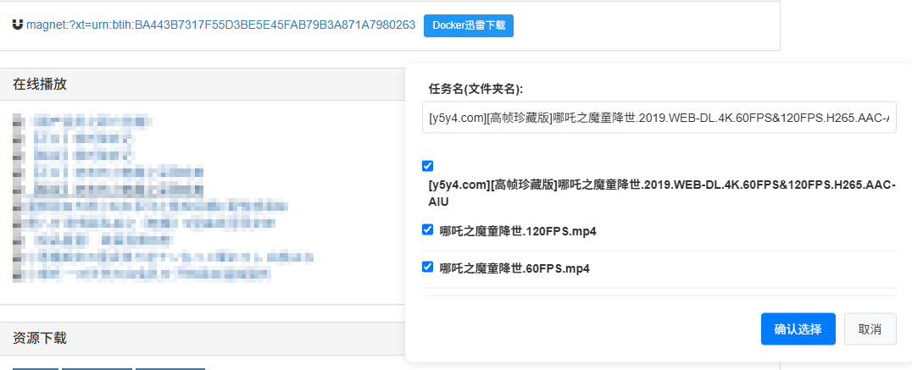

# 迅雷Docker下载助手 Chrome扩展

[](LICENSE)
[](https://github.com/saaak/xunlei-docker-ext/releases)

简体中文 | [English](README_EN.md)

简化与Docker迅雷下载服务（[cnk3x/xunlei](https://github.com/cnk3x/xunlei)）的交互，提供快速提交及管理下载任务的功能。




## ✨ 功能特性

- 🐳 **连接远程迅雷** - 轻松连接到Docker容器中的迅雷远程下载服务
- ⚙️ **简易配置** - 快速配置Docker迅雷服务的主机地址和端口
- 📊 **任务管理** - 展示当前进行中和已完成的下载任务
- 🔗 **一键添加** - 自动检测网页磁力链接并添加下载任务

## 📦 安装

### 前提条件
- 已部署Docker迅雷服务（[cnk3x/xunlei](https://github.com/cnk3x/xunlei)）
- Docker迅雷容器网络可从浏览器访问

### 开发者模式安装

1. 下载扩展：
   ```bash
   git clone https://github.com/saaak/xunlei-docker-ext.git
   ```
   或从[Releases页面](https://github.com/saaak/xunlei-docker-ext/releases)下载zip包

2. 在Chrome中打开`chrome://extensions/`

3. 启用"开发者模式"

4. 点击"加载已解压的扩展程序"并选择项目目录

## 🚀 使用指南

1. **配置连接**
   - 点击扩展图标
   - 输入Docker迅雷的Host和Port
   - 设置默认文件类型（可选, 不配则默认全选）
   - 点击"保存配置"

2. **添加下载任务**
   - 浏览含磁力链接的网页
   - 点击链接旁的"Docker迅雷下载"按钮
   - 自定义任务名称（可选）
   - 选择文件并确认

3. **查看任务状态**
   - 点击扩展图标查看任务列表
   - 显示下载进度、速度等信息
   - 切换查看已完成和进行中的任务

## 📝 开发计划

### ✅ 已完成功能
- [x] 基础配置页面
- [x] 磁力链接检测与下载按钮注入
- [x] 文件选择
- [x] 任务提交
- [x] 配置默认文件类型

### 🚧 计划中功能
- [ ] 支持更多种下载链接
- [ ] 支持自定义下载链接规则
- [ ] 下载完成通知
- [ ] 国际化支持

## 👥 贡献指南

欢迎贡献代码、报告问题或提出新功能建议！

1. Fork 本仓库
2. 创建您的特性分支 (`git checkout -b feature/amazing-feature`)
3. 提交您的更改 (`git commit -m 'Add some amazing feature'`)
4. 推送到分支 (`git push origin feature/amazing-feature`)
5. 打开一个 Pull Request

## 📜 许可证

本项目采用 [MIT License](LICENSE)

## 🙏 致谢

- [cnk3x/xunlei](https://github.com/cnk3x/xunlei) - Docker迅雷服务
