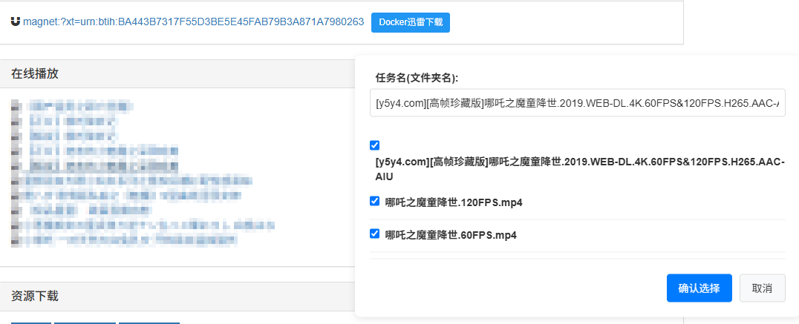

# Xunlei Docker Download Assistant Chrome Extension

[](LICENSE)
[](https://github.com/saaak/xunlei-docker-ext/releases)

[简体中文](README.md) | English

Simplify interaction with Docker Xunlei download service ([cnk3x/xunlei](https://github.com/cnk3x/xunlei)), providing quick submission and management of download tasks.



## ✨ Features

- 🐳 **Connect to Remote Xunlei** - Easily connect to Xunlei remote download service in Docker container
- ⚙️ **Simple Configuration** - Quickly configure host address and port for Docker Xunlei service
- 📊 **Task Management** - Display current in-progress and completed download tasks
- 🔗 **One-Click Add** - Automatically detect magnet links on webpages and add download tasks

## 📦 Installation

### System Requirements
- Chrome browser (version 88 or higher recommended)
- Docker Xunlei service ([cnk3x/xunlei](https://github.com/cnk3x/xunlei)) deployed
- Network access from browser to Docker Xunlei container

### Chrome Web Store Installation

*Coming soon*

### Developer Mode Installation

1. Download the extension:
   ```bash
   git clone https://github.com/saaak/xunlei-docker-ext.git
   ```
   Or download the zip package from [Releases page](https://github.com/saaak/xunlei-docker-ext/releases)

2. Open `chrome://extensions/` in Chrome

3. Enable "Developer mode"

4. Click "Load unpacked" and select the project directory

## 🚀 Usage Guide

1. **Configure Connection**
   - Click the extension icon
   - Enter the Host and Port of Docker Xunlei
   - Set default file types (optional, all selected by default)
   - Click "Save Configuration"

2. **Add Download Task**
   - Browse webpages with magnet links
   - Click the "Docker Xunlei Download" button next to the link
   - Customize task name (optional)
   - Select files and confirm (selecting a folder will select all its child files)

3. **View Task Status**
   - Click the extension icon to view the task list
   - Display download progress, speed, and other information
   - Switch between completed and in-progress tasks

## 📝 Development Plan

### ✅ Completed Features
- [x] Basic configuration page
- [x] Magnet link detection and download button injection
- [x] File selection
- [x] Task submission
- [x] Configure default file types

### 🚧 Planned Features
- [ ] Support for more download link types
- [ ] Custom download link rules
- [ ] Download completion notifications
- [ ] Internationalization support

## 👥 Contribution Guidelines

Contributions of code, issue reports, or new feature suggestions are welcome!

1. Fork this repository
2. Create your feature branch (`git checkout -b feature/amazing-feature`)
3. Commit your changes (`git commit -m 'Add some amazing feature'`)
4. Push to the branch (`git push origin feature/amazing-feature`)
5. Open a Pull Request

## 📜 License

This project is licensed under the [MIT License](LICENSE)

## 🙏 Acknowledgements

- [cnk3x/xunlei](https://github.com/cnk3x/xunlei) - Docker Xunlei service